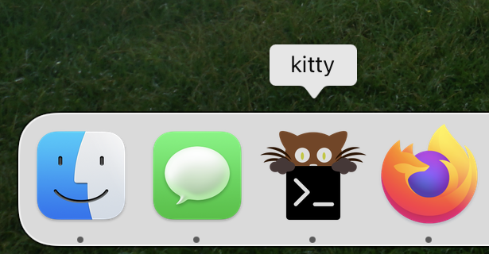
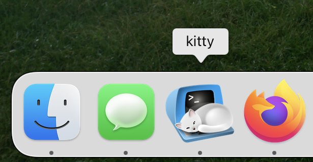

Alternative icon for the [kitty](https://github.com/kovidgoyal/kitty) terminal
emulator. Depicts a cat sitting on top of a ADM-3A terminal.

Currently, I only have the source as an Affinity Designer file that makes
liberal use of blur effects. Thus, I can't export to svg without losing some of
the fluffiness of the cat.

## Before:

 

## After:

